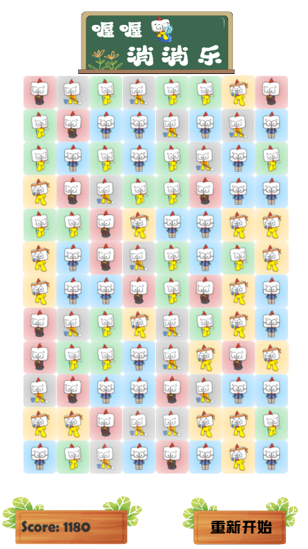

# 喔喔消消乐

一个使用 Unity 制作的三消小游戏。玩家通过拖拽交换相邻棋子，连成 3 个及以上同色棋子即可消除得分；4 连及以上会生成特殊棋子，触发后可以清除整行或整列。

在线试玩：[https://youngleeyoung.itch.io/wwxxlmobile](https://youngleeyoung.itch.io/wwxxlmobile)



## 游戏玩法

- 鼠标或触屏按住一个棋子并向相邻方向拖动，即可尝试交换。
- 只有交换后能形成 3 连或以上时，交换才会生效；否则棋子会自动换回。
- 消除后，上方棋子会下落，并从顶部补充新的棋子。
- 连锁消除会获得额外分数。
- 4 连及以上会生成奖励棋子，奖励棋子参与消除时会清除整行或整列。
- 一段时间没有操作时，游戏会自动闪烁提示一个可行的消除机会。

## 项目信息

- 引擎版本：Unity `2022.3.52f1c1`
- 主场景：`Assets/Scenes/mainGame.unity`
- 棋盘规模：12 行 x 8 列
- WebGL 参考分辨率：960 x 600
- 默认产品名：喔喔消消乐

## 目录结构

```text
Assets/
  Scenes/              主游戏场景
  Scripts/             三消逻辑、棋盘管理、得分和音效脚本
  Prefabs/             普通棋子、特殊棋子和爆炸效果预制体
  Sprites/             糖果与特效素材
  WOPic/               当前主题使用的图片素材
  Sounds/              游戏音效
  Resources/level.txt  预设关卡数据示例
Packages/              Unity 包依赖
ProjectSettings/       Unity 项目设置
```

## 核心脚本

- `ShapesManager.cs`：游戏主控制器，负责棋盘初始化、拖拽输入、交换、消除、掉落、补充、计分和提示。
- `ShapesArray.cs`：棋盘二维数组封装，负责交换、撤销交换、查找横向/纵向匹配、塌落和空位查询。
- `Shape.cs`：单个棋子的类型、行列坐标和奖励类型数据。
- `Utilities.cs`：可消除机会检测、提示闪烁动画和相邻判断。
- `SoundManager.cs`：消除音效播放。
- `DebugUtilities.cs`：调试输出和从 `Resources/level.txt` 读取预设关卡。
- `Constants.cs`：棋盘尺寸、动画时间、得分规则等常量。

## 本地运行

1. 安装 Unity `2022.3.52f1c1` 或兼容的 Unity 2022.3 LTS 版本。
2. 使用 Unity Hub 打开本仓库目录。
3. 打开场景 `Assets/Scenes/mainGame.unity`。
4. 点击 Unity Editor 顶部的 Play 按钮运行游戏。

## WebGL 构建

1. 在 Unity 中打开 `File > Build Settings...`。
2. 选择 `WebGL` 平台并点击 `Switch Platform`。
3. 确认 `Assets/Scenes/mainGame.unity` 已在 Scenes In Build 中启用。
4. 点击 `Build` 或 `Build And Run` 输出 WebGL 版本。

仓库中包含 `connectwebgl.zip`，可作为既有 WebGL 构建包参考；最新版本建议从 Unity 重新构建。

## 调整玩法

- 修改棋盘尺寸：编辑 `Assets/Scripts/Constants.cs` 中的 `Rows` 和 `Columns`，同时注意场景相机、棋子尺寸和布局位置是否需要同步调整。
- 修改得分：编辑 `Match3Score` 和 `SubsequentMatchScore`。
- 修改动画节奏：编辑 `AnimationDuration`、`MoveAnimationMinDuration`、`ExplosionDuration`。
- 修改提示等待时间：编辑 `WaitBeforePotentialMatchesCheck`。
- 使用预设关卡：维护 `Assets/Resources/level.txt`，并在代码或场景调用 `InitializeCandyAndSpawnPositionsFromPremadeLevel()`。

## 素材与来源

本项目基于经典 Unity 三消示例改造，并保留了原项目中的部分素材来源说明：

- 糖果图形素材：<http://opengameart.org/content/candy-pack-1>
- 消除音效：<http://freesound.org/people/volivieri/sounds/37171/>
- 原教程参考：<http://dgkanatsios.com/2015/02/25/building-a-match-3-game-in-unity-3/>

请在发布或二次分发前确认所有素材许可证与实际使用范围相匹配。
